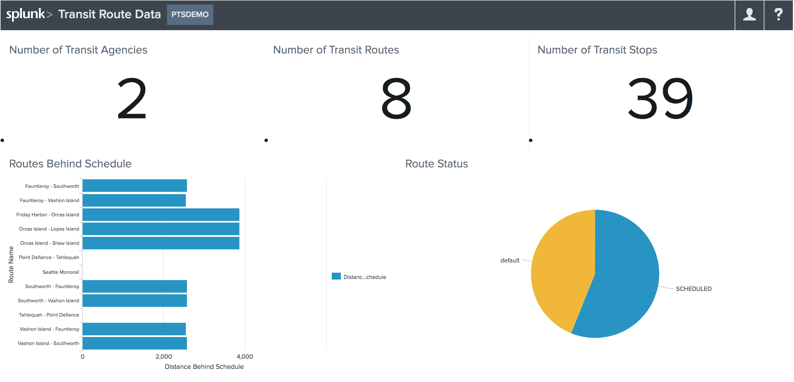

# Seattle Transit Route Status Dashboard

This example shows how to render a simple dashboard to who transit route status by stop used by Seattle Transit. 




## Requirements

To run the examples, install the following:
-   NodeJS version 8.3.0 or later
-   Yarn version 1.3.2 or later

You also need the following values:
-   The name of your Splunk Cloud tenant
-   The client ID from the Splunk Cloud app you created (instructions at ../demo/README.md)
-   A passthrough Splunk Data Stream Processor pipeline activated (instructions at ../demo/README.md)
-   Sample transit data ingested (instructions at ../demo/README.md)


## Get started

Follow the instructions below to set up and run this example:

1. At the command line, navigate to this `transit_dashboard_app` folder. 

```diff
- 2. Open the **.npmrc** file and replace `YOUR NPMJS TOKEN` with your npmjs token.
```

3. Install the dependencies by running the following command: 

    ```
    $ yarn
    ```

4.  In the **./src/config/config.json** file, update the following values where appropriate: 
    * Replace `YOUR CLIENT ID` with your client ID.
    * Replace `YOUR TENANT ID` with your tenant name.

5.  Start the example app in develop mode: 
    
    ```
    $ yarn run start
    ```

6.  In a browser, open `localhost:9009` to view the app.


## Built with
```diff
- * [Splunk Cloud SDK for JavaScript](https://sdc.splunkbeta.com/docs/overview/sdctools/tools_jssdk/), which uses JavaScript to communicate with the Splunk Cloud REST APIs
- * [Splunk Cloud Auth component](https://sdc.splunkbeta.com/docs/auth/cloud-auth), which provides a UI for users to authenticate with Splunk Cloud
- * [SplunkUI component](https://sdc.splunkbeta.com/docs/dashviz/splunkui), which is a package of libraries, components, utilities, and tools for creating a UI
- * [Dashboard component](https://sdc.splunkbeta.com/docs/dashviz/dash), which contains a framework for working with dashboards and visualizations
```
